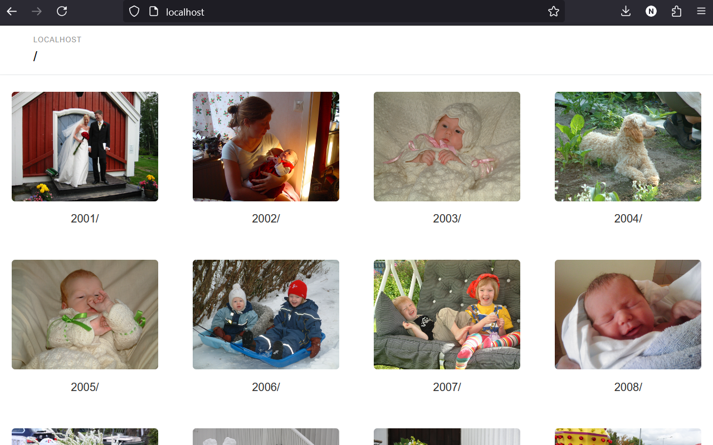

# Caddy File Server Template

File server template for the [Caddy](https://caddyserver.com/) web
server, modified to optionally display a picture for a directory if
there is a hidden file, a file with a leading *.*, with the same name
as the directory, and a *.jpg* extension.

For example if there is a directory with the name *2001* and an image,
or a symbolic link to an image, named *.2001.jpg*, the image will be
displayed as the directory, instead of the generic directory image.

The template makes it possible to use *Caddy* as a simple photo album,
like in the screenshot below.



Example [Caddyfile](https://caddyserver.com/docs/caddyfile) that uses
the template.

```
example.com {
	root * /srv/pictures
	file_server {
		browse /srv/caddy-template/browse.html
	}
}
```
